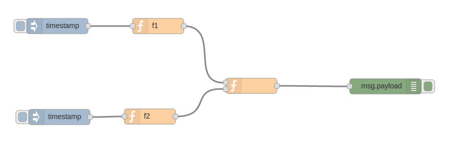
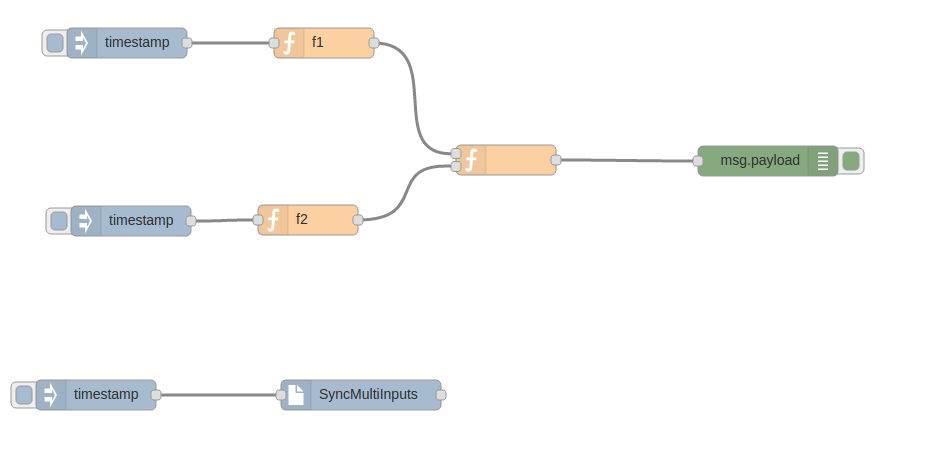

## Node-red with multiple inputs

Now a function can have more than one input. The inside code is called only if all the inputs are defined.
In this case, the function is called using:
```
msg.load = { functionInput1: xxxx, functionInput2: xxxx, functionInput3: xxxx  }
``` 

To reset" the inputs msg we have a special node called :" syncMultiInputs"


###Simple Flow:    



f1=f2=
```
var date = new Date(msg.payload);
msg.payload = date.toString();
return msg;
```

if you click on both timestamp you will see in the debug view:  
{ "f1": "Thu May 12 2016 14:35:57 GMT-0300 (ART)", "f2": "Thu May 12 2016 14:35:57 GMT-0300 (ART)" }

###Flow with syn node:



In this flow, if you click on timestamp Sync... you will have to "execute" amboth function (f1,f2) to show again the debug msg.
- - -


### Build / Run

If you want to run the latest code from git, here's how to get started:

1. Install grunt, the build tool

        npm install -g grunt-cli

2. Clone the code:

        git clone https://github.com/clives/node-red_multiple-inputs.git
        cd node-red

3. Install the node-red dependencies

        npm install

4. Build the code

        grunt build

5. Run

        node red.js
        
## Authors Node-RED

Node-RED is a creation of [IBM Emerging Technology](http://ibm.com/blogs/et).

* Nick O'Leary [@knolleary](http://twitter.com/knolleary)
* Dave Conway-Jones [@ceejay](http://twitter.com/ceejay)

For more open-source projects from IBM, head over [here](http://ibm.github.io).

## Copyright and license

Copyright 2013, 2016 IBM Corp. under [the Apache 2.0 license](LICENSE).
